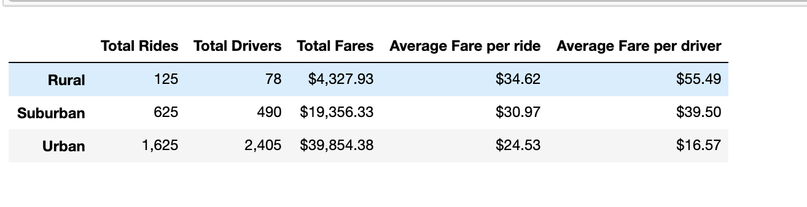

## Overview of Project

### Purpose
In this assignment, we are helping a new data analyst Omar, who works in a python based drive sharing company Pyber, to analyze a set of ride-sharing data and research how the drive fares are effected by key factors. We will first analyze the difference in fares based on their city type. Then we will present the change of fare in each city type from a specific period of time and visualize the result by using multi-line graph. Our goal is to demonstrate our analysis by utilizing the use of matplotlib so that the result can be easily read and interpreted by a non- data analysis background individual.

## Results

### Description of the raw datasets
Before we started our research, we will first give a brief introduction about the raw two data worksheets that we are given. The city data sheet gives us the information for the number of driver in each city along with its city type. And the ride sheet provide us the fare values and their corresponding city name and drive date. There is three city type discusesed in this assignment: Rural, Suburban and Urban

### Main method of grouping data
We first merged the two worksheet together into one single data frame and then use the powerful groupby() method to group the total ride, “ride_id”,by the city type, as the following codes:

> ride_count = pyber_data_df.groupby(["type"]).count()["ride_id"]
>

### Description of the differences in ride-sharing data
We then applied the logic to get the key information including: total drivers, total fares, average fare per ride and driver, and total fare. The below table summarize the result of our analysis. 

1
According to the above table, we can conclude the following key bullet point.

1) Urban has the biggest number of total ride and total driver, which is 1625 and 2405 respectively, followed by Suburban which is 625 and 490. Rural has the least number of both ride and driver, which is 125 and 78.
2) Further to the #1 key point, not surprisingly, the total value of fares in Urban is the largest, which is $39854.38. The second largest is that in Suburban, which is $19356.33. And the last one is that in Rural, which is $4327.93 in total. 
3) In Contrast with the #1 and #2 key points, not only does the average fare value per ride in Rural outcome the other two, but also the average fare value per driver in Rural is the largest among three city types. The order of both average fare per ride and average fare per driver, from the largest to the least, is Rural, Suburban and Urban.

### Three business recommendations to the CEO

From the observation that Rural city has the largest value of average fare per drive and ride, while it has the least number of driver, we can conclude the following:

1) The people who live in Rural city may have biggest consumption power and they are willing to pay more for each ride. This may indicate that customer who lives in Rural is a narrow community with wealth. Thus we should provide more luxury or prime riding service in this type of city so that the company can attract more customer and earn more profitable income.
2) Alternatively, the reason why Rural people are paying more for each ride, may be simply because there is no enough driver in this area. So where there is shortage in supply, in order to have the service, the customer needs to pay more. In this case, we will recommend the CEO to use strategy to attract more driver in this area so the total number of driver and total value of fares will increase.

It is also very interest to notice that the ratio of total rides to total drivers. It’s very clear that for each drive in Rural, each driver has about 1.5 rides, while in Urban each driver only has roughly 0.5 ride. This clearly indicates that there is surplus in supply in Urban area. 

3) Thus we will recommend the CEO to either cut the number of driver in Urban area, or alternative introduce more type of riding service, making the services more divisified, in Urban area so that driver will have more change to serve the clients. 
